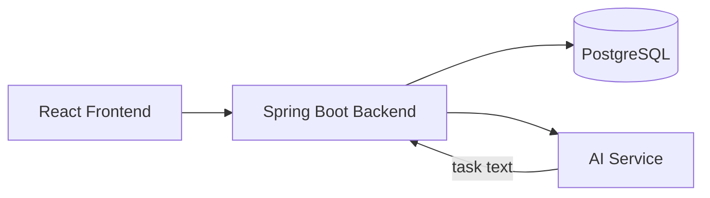

# TaskSphere

AI-powered task management system built with React.js, Spring Boot, MySQL, and FastAPI, providing task management, JWT authentication, role-based access control, Kanban-style tracking, and AI-assisted task classification.

**Live Demo:** Deploying soon

**Tech Stack:**
Java · Spring Boot · React.js · MySQL · Python · FastAPI · JWT

## What this demonstrates

- **Full-stack application architecture** — React.js frontend, Spring Boot REST backend, MySQL database, and a separate Python FastAPI AI service.

- **Secure application development** — JWT authentication and role-based access control for protected application functionality.

- **AI integration in a real application** — AI-based task classification and priority prediction integrated into the task-management workflow.

## Architecture


<!-- Replace with your actual data flow once you confirm how the AI service talks to the backend (REST call? shared DB? queue?) -->

## Quick start

```bash
git clone https://github.com/sudinvp/tasksphere
cd tasksphere
cp .env.example .env   # fill in your values
docker compose up
# or run each service manually — see /docs/architecture.md
```

Open http://localhost:3000 (frontend) and http://localhost:8080 (backend API).

## Architecture decisions (the "why")

**Why Spring Boot over Node for the backend:** ...
**Why a separate AI service instead of embedding the model in the backend:** ...
**Why [your DB choice] for task/user storage:** ...
**Why urgency is a weighted probability score, not a fixed category:** The classifier outputs a probability distribution across 4 urgency classes (from title/description text) combined with days-until-due-date, producing a continuous 0–1 score rather than a hardcoded label — so a task like "Fix login failure" with a moderate deadline lands in an honest middle zone (~0.51) instead of being forced into an arbitrary bucket.
**Why notifications are strictly assignee-scoped:** `NotificationService.notify()` always targets the task's assignee — on creation, reassignment, status change, and the daily deadline-reminder job — with no role-based broadcast to admins. Every fetch (`/api/notifications`, `/api/tasks/mine`) filters by the JWT principal's own ID, so there's no cross-user leakage by construction.

See [/docs/DECISIONS.md](docs/DECISIONS.md) for the full log.

## What I struggled with

- The urgency model was trained on synthetic, templated data. It generalizes well on strong signal words ("urgent," "crash," "fix") but produces ambiguous mid-range scores (0.45–0.55) on text that doesn't match a template — I had to verify this wasn't a bug by testing extreme cases side-by-side (a clear-urgent vs. clear-low-priority task) before trusting the scores.
- Debugging "why does everything score ~0.51" required tracing through the actual class-probability weighting rather than assuming the model was broken — it turned out to be a real property of ambiguous input, not a defect.
- [A real integration problem between the backend and the AI service, if any]
- [A real deployment/config issue you hit]

## Roadmap

- [x] v0.1 — Core task CRUD (backend + frontend)
- [x] v0.2 — AI auto-categorization service
- [ ] v0.3 — Auth + multi-user support
- [ ] v1.0 — Public deploy

## Code style

This repository follows the [Google Java Style Guide](https://google.github.io/styleguide/javaguide.html) for the backend and the [Google JavaScript Style Guide](https://google.github.io/styleguide/jsguide.html) for the frontend.

## Contributing

PRs welcome. Run the test suite before submitting.

## License

MIT — see [LICENSE](LICENSE).
