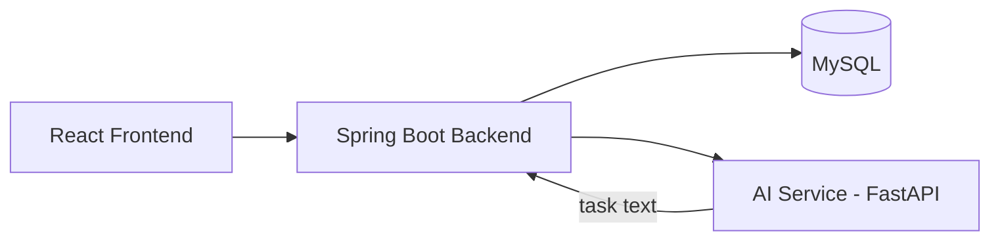

# TaskSphere

AI-powered task management system built with React.js, Spring Boot, MySQL, and FastAPI, providing task management, JWT authentication, role-based access control, Kanban-style tracking, and AI-assisted task classification.

**Live Demo:** Deploying soon

**Tech Stack:**

    

---

## What this demonstrates

- **Full-stack application architecture** — React.js frontend, Spring Boot REST backend, MySQL database, and a separate Python FastAPI AI service.
- **Secure application development** — JWT authentication and role-based access control for protected application functionality.
- **AI integration in a real application** — AI-based task classification and priority prediction integrated into the task-management workflow.

## Architecture



<!-- Replace with your actual data flow once confirmed: does the backend call the AI service synchronously per-request, or is classification done async/batched? -->

## Quick start

```bash
git clone https://github.com/sudinvp/tasksphere
cd tasksphere
cp .env.example .env   # fill in your values
docker compose up
# or run each service manually — see /docs/architecture.md
```

Open http://localhost:3000 (frontend) and http://localhost:8080 (backend API).

<!-- Confirm: do you have a single root-level docker-compose.yml that starts frontend + backend + AI service + MySQL together, or does each service need to be started separately right now? If separate, replace the Quick Start block with the manual steps for each service. -->

## Architecture decisions (the "why")

**Why Spring Boot over Node.js for the backend:**
[Your real reasoning — e.g. team/course familiarity with Java, strong typing for a multi-role permission system, built-in Spring Security for JWT + RBAC, or prior experience from your internship]

**Why a separate AI service instead of embedding the model in the backend:**
[Your real reasoning — e.g. Python's ML ecosystem (scikit-learn/PyTorch) isn't available in the JVM, keeping the classifier as an independent service means it can be redeployed/retrained without touching the Java backend, or it mirrors how production ML services are actually separated from application backends]

**Why MySQL for task/user storage:**
[Your real reasoning — e.g. relational structure fits naturally: users → roles → tasks → comments as foreign-keyed tables; strong familiarity from coursework/internship; works cleanly with Spring Data JPA/Hibernate out of the box]

**Why urgency is a weighted probability score, not a fixed category:**
The classifier outputs a probability distribution across 4 urgency classes (from title/description text) combined with days-until-due-date, producing a continuous 0–1 score rather than a hardcoded label — so a task like "Fix login failure" with a moderate deadline lands in an honest middle zone (~0.51) instead of being forced into an arbitrary bucket.

**Why notifications are strictly assignee-scoped:**
`NotificationService.notify()` always targets the task's assignee — on creation, reassignment, status change, and the daily deadline-reminder job — with no role-based broadcast to admins. Every fetch (`/api/notifications`, `/api/tasks/mine`) filters by the JWT principal's own ID, so there's no cross-user leakage by construction.

See [/docs/DECISIONS.md](docs/DECISIONS.md) for the full log.

## What I struggled with

- The urgency model was trained on synthetic, templated data. It generalizes well on strong signal words ("urgent," "crash," "fix") but produces ambiguous mid-range scores (0.45–0.55) on text that doesn't match a template — I had to verify this wasn't a bug by testing extreme cases side-by-side (a clear-urgent vs. clear-low-priority task) before trusting the scores.
- Debugging "why does everything score ~0.51" required tracing through the actual class-probability weighting rather than assuming the model was broken — it turned out to be a real property of ambiguous input, not a defect.
- [A real integration problem between the backend and the AI service, if any — e.g. timeout handling, request/response schema mismatches, retry logic]
- [A real deployment/config issue you hit — e.g. environment variable handling across services, CORS between frontend and backend, database connection pooling]

<!-- Two honest lines beat five padded ones. If you don't have more real struggles, leave it at the two above — do not invent generic ones. -->

## Roadmap

- [x] v0.1 — Core task CRUD (backend + frontend)
- [x] v0.2 — AI auto-categorization service
- [ ] v0.3 — Auth + multi-user support
- [ ] v1.0 — Public deploy

## Code style

This repository follows the [Google Java Style Guide](https://google.github.io/styleguide/javaguide.html) for the backend and the [Google JavaScript Style Guide](https://google.github.io/styleguide/jsguide.html) for the frontend.

## Contributing

PRs welcome. Run the test suite before submitting.

## License

MIT — see [LICENSE](LICENSE).
